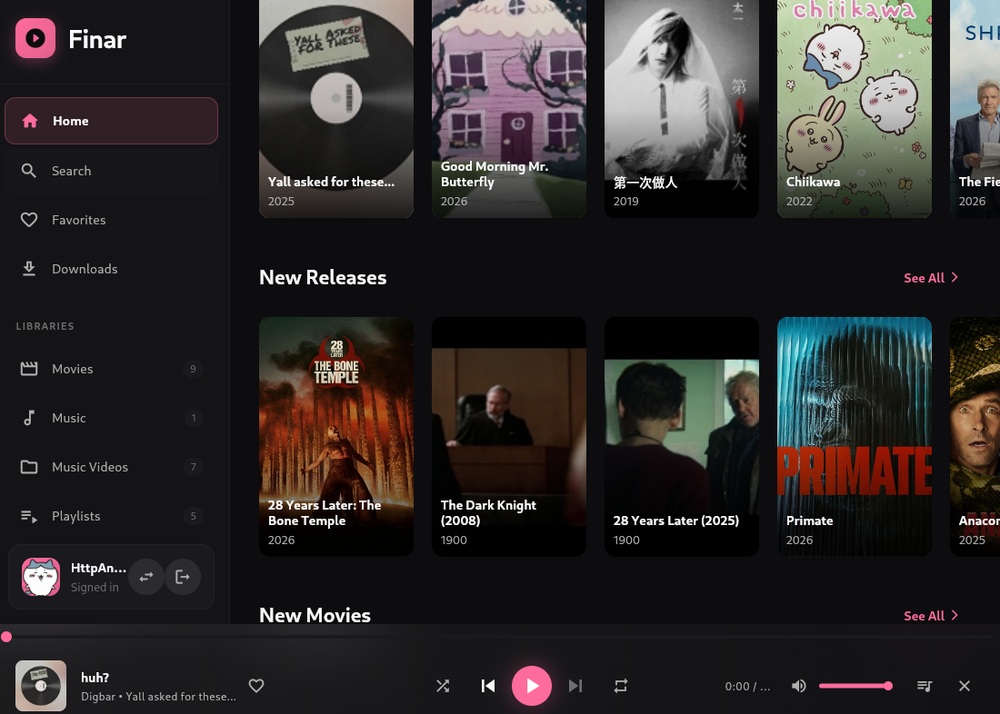

# Finar

Finar is a Jellyfin client built to just work.




## Features

- Video playback
- Android, iOS, macOS, Windows, Linux, and Web support
- Desktop and Mobile UI.
- Downloads
- Multiple accounts (eg. The who's watching screen)
- Controller support
- Music playback


## Contributing

Pull requests are welcome. 

## AI

- All AI made code is allowed however you are responsible for testing and verifying the code.

## Requirements

- Flutter SDK `^3.10.3`
- A running [Jellyfin](https://jellyfin.org/) server

## Getting Started

```bash
git clone https://gitlab.com/Openlyst/finar.git
cd finar
flutter pub get
dart run build_runner build --delete-conflicting-outputs
flutter run
```

## Build Releases

```bash
flutter build apk --release
flutter build ios --release
flutter build macos --release
flutter build windows --release
flutter build linux --release
flutter build web --release
```

## Privacy

See [PRIVACY.md](PRIVACY.md) for how Finar handles data (no collection; data stays on your device and your Jellyfin server).
